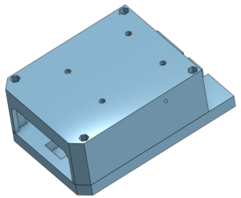
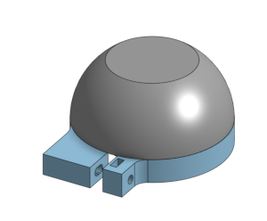

# mandeye_controller

# Hardware documementation

## Supported hardware
We support the following hardware:
- Raspbery Pi 4 or 5 without any special hardware (bunch of of-the-shelf components and 3D printed parts)
- Raspbery Pi 4 Compute module with custom carrier board. The carrier board is not part of this repository and is available on request.

Both version shares the same software, but are different in hardware (e.g. different GPIO layout, some extra features on custom carrier board).
The target hardware is defined during compilation time.
If you want to extend this project to different platforms or hardware, please refer to source code available in [hardware](./src/hardware) directory.


## 3D Model

The source design is available on Onshape, and you can access it [here](https://cad.onshape.com/documents/a6c6019ccb399ad39d830fad/w/0440af658555626c8fea1136/e/e1bf637894052d9247ac984d?renderMode=0&uiState=651c527c78128a19b84b4be1).

The design files for 3D printing are available in the repository's 3mf directory. You can find the file [ScannerAssembly.3mf](./3mf/ScannerAssembly.3mf) containing the models to be printed.

For optimal results, we recommend printing the assembly with PLA. Don't forget to adjust the 3MF file according to your printer specifications. If you need assistance with this, consider including a brief guide or tips on printer adjustments.



Additionally, we recommend printing a protective cap for Livox Mid-360, which you can find in the [LivoxCap.3mf](./3mf/LivoxCap.3mf) file.



Feel free to reach out if you have any questions or need further assistance!

## Bill of Materials
[Click here to BIM](doc/BIM.md)

## Wiring

[Wiring manual](doc/wiring/wiring.md)


## Video guide 
Time-lapse video guide to build and configure the system.

[Youtube video](https://youtu.be/BXBbuSJMFEo)

# Software

# Important notes
Currently Raspbian Bookworm is recommended for the system. The system is tested on Raspbian Bookworm. 
The version v0.5 supported Bullseye, current main branch supports Bookworm.
The software can run other distros (e.g. Ubuntu) but it is not tested and maintained.

## Update system
```bash
sudo apt-get update
sudo apt-get upgrade
sudo apt-get install build-essential cmake git rapidjson-dev debhelper build-essential ntfs-3g libserial-dev libgpiod-dev libzmq3-dev
```


## Static IP for eth0

```bash
sudo nano /etc/dhcpcd.conf
```
And add in the end:
```
interface eth0
static ip_address=192.168.1.5/24
static routers=0.0.0.0    
```

## Clone and build app

Note that, target hardware is defined during compilation time using `-MANDEYE_HARDWARE_HEADER=mandeye-standard-rpi4.h` parameter.
The `MANDEYE_HARDWARE_HEADER` is one of the headers in `code/hardware_config`:
```bash
$ ls ./code/hardware_config/mandeye-*.h
./code/hardware_config/mandeye-pro-cm4-bookworm.h
./code/hardware_config/mandeye-pro-cm4-bullseye.h
./code/hardware_config/mandeye-standard-rpi4.h
./code/hardware_config/mandeye-standard-rpi5.h
```

| Hardware header            | What is supported             |
|----------------------------|-------------------------------|
|mandeye-standard-rpi4.h     | Raspberry Pi 4                |
|mandeye-standard-rpi5.h     | Raspberry Pi 5                |
|mandeye-pro-cm4-bookworm.h  | Raspberry Pi Compute module 4 plus carrier board|
|mandeye-pro-cm4-bullseye.h  | Deprecated                    |


The next example shows how to build the app for Raspberry Pi 4 without custom carrier board at Raspberry Pi 4.
```
git clone https://github.com/JanuszBedkowski/mandeye_controller.git
cd mandeye_controller
git submodule init
git submodule update
mkdir -p build && cd build
cmake .. -DCMAKE_BUILD_TYPE=Release -DMANDEYE_HARDWARE_HEADER=mandeye-standard-rpi4.h 
make -j1 # -j4 can be used for 8 Gb version
```

## Test wiring and hardware
Before running the application, you should test the wiring and hardware. You can use the following commands to test the hardware:
```bash
cd mandeye_controller/build
./led_demo
./button_demo
```
Both program should work correctly, without need of `sudo`. If not , check if your user is in `gpio` group, if not add it:
```bash
sudo usermod -a -G gpio $USER
```

## Set USB mount
Follow manual for build and configuration of USB mount
https://gist.github.com/michalpelka/82d44a21c29f34ee5320c349f8bbf683

```shell
cd /tmp
git clone https://github.com/rbrito/usbmount.git
cd usbmount
dpkg-buildpackage -us -uc -b
cd ..
sudo apt install ./usbmount_0.0.24_all.deb
```

Edit config `sudo nano /etc/usbmount/usbmount.conf`:
by changing keys:
```shell
FILESYSTEMS="vfat ext2 ext3 ext4 hfsplus ntfs fuseblk"
FS_MOUNTOPTIONS="-fstype=vfat,users,rw,umask=000 -fstype=exfat,users,rw,umask=000"
VERBOSE=yes
```
Install udev rules:
```shell
sudo mkdir /etc/systemd/system/systemd-udevd.service.d
sudo nano -w /etc/systemd/system/systemd-udevd.service.d/00-my-custom-mountflags.conf
```
and add content:
```shell
[Service]
PrivateMounts=no
```

Restart udev:
```shell
sudo systemctl daemon-reexec
sudo service systemd-udevd restart
```

Verify if usb mount works correclty:
```shell
touch /media/usb/test
```
```shell
tail -f /var/log/syslog
```

## Setup systemctl for autostart
Create a file `/usr/lib/systemd/system/mandeye_controller.service` with content.
Note that you need to adjust your user's name:
```
[Unit]
Description=Mandeye
After=multi-user.target

[Service]
User=mandeye
StandardOutput=null
StandardError=null
ExecStartPre=/bin/sleep 20
ExecStart=/home/robot/mandeye_controller/build/control_program
Restart=always

[Install]
WantedBy=multi-user.target
```

Next reload daemons, enable and start the service`
```
sudo systemctl daemon-reload
sudo systemctl enable mandeye_controller.service
sudo systemctl start mandeye_controller.service
```
You can check status of the service with:
```bash
sudo systemctl status mandeye_controller.service
```

# Buildinng DEB package
To build DEB package, you need to install additional packages:
```bash
sudo apt-get install debhelper
```

Then you can build the package:
```bash
cd mandeye_controller
mkdir -p build && cd build
cmake .. -DCMAKE_BUILD_TYPE=Release -DMANDEYE_HARDWARE_HEADER=mandeye-standard-rpi4.h
make -j1 # -j4 can be used for 8 Gb version
make package
```

The package will be available in the build directory.

# Installation and usage of the package
To install the package, you need to copy it to the target device and install it with `dpkg`:
```bash
sudo dpkg -i mandeye_controller-0.1.0-Linux.deb
```

The package will be installed in `/opt/mandeye/` directory, the service will be added to `/usr/lib/systemd/system/`.
Note that the service will not start automatically, you need to start it manually or enable it with `systemctl`.
There is a helper script `/opt/mandeye/helper.sh` that contains some useful commands to start, stop, and restart the service.

Add it to bashrc:
```bash
echo "source /opt/mandeye/helper.sh" >> ~/.bashrc
```

After that start required services:

```shell
mandeye_start
```

There are optional services that can be started:
```shell
mandeye_fakepps_start
mandeye_camera_start
mandeye_camera_ftp_start
```
