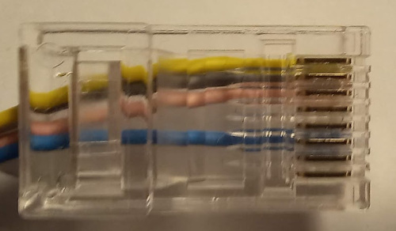
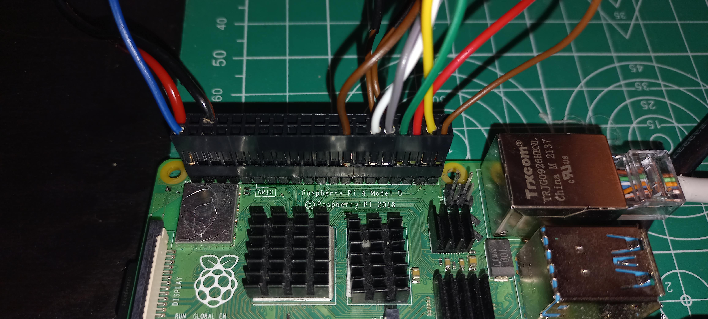

# Wiring 

## Wiring connection to Livox MID360
### Pinout of M12A12FL12AFLSD001
Pins numbers, in plug, from documentation : [link](https://eu.mouser.com/datasheet/2/18/Amphenol_02112019_M12AXXFL-12AFL-SXXXX(A)-1531779.pdf)

| Pin | Color  | Function |
|-----|--------|----------|
|  1  | White  | Power +  |
|  9  | Black  | Power +  |
|  2  | Brown  | Ground   |
|  3  | Green  | Ground   |
|  4  | Yellow | ETH-TX+  |
|  5  | Gray   | ETH-TX-  |
|  6  | Pink   | ETH-RX+  |
|  7  | Blue   | ETH-RX-  |
|  8  | Red    | PPS      |
| 10  | Violet | NMEA     |
| 11  | Gray/Pink | N/A   |
| 12  | Gray/Pink | N/A   |

### Connecting to RJ45 

| Pin RJ45 | Color  | Function |
|-----|--------|----------|
|  1  | Yellow | ETH-TX+  |
|  2  | Gray   | ETH-TX-  |
|  3  | Pink   | ETH-RX+  |
|  4  |        |          |
|  5  |        |          |
|  6  | Blue   | ETH-RX-  |
|  7  |        |          |
|  8  |        |          |

Correct wiring in the photo below:

## Wiring connection to Raspberry pi

| Pin  | Name   | Connection |   |   |  Connection |  Name    | Pin |
|------|--------|------------|---|---|-------------|----------|-----|
| 01   | 3.3v   |            |   | X |  DC 5V      | 5v       | 02  |
| 03   | GPIO02 |            |   |   |             | 5v       | 04  |
| 05   | GPIO03 |            |   | X |  GND        | GND      | 06  |
| 07   | GPIO4  |            |   |   |             | GPI014   | 08  |
| 09   | GND    |            |   |   |             | GPI015   | 08  |
| 11   | GPI017 |            |   |   |             | GPI018   | 12  |
| 13   | GPI027 |            |   |   |             | GND      | 14  |
| 15   | GPI022 |            |   |   |             | GPIO23   | 16  |
| 17   | 3.3V   |            |   |   |             | GPIO24   | 18  |
| 19   | GPI010 |            |   |   |             | GND      | 20  |
| 21   | GPI009 |            |   |   |             | GPIO25   | 22  |
| 23   | GPI011 |            |   |   |             | GPIO28   | 24  |
| 25   | GND    | 0V         | X |   |             | GPIO07   | 26  |
| 27   | GPI000 |            |   |   |             | ID_SC    | 28  |
| 29   | GPIO05 | Button1    | X |   |             | GND      | 30  |
| 31   | GPIO06 | Button2    | X |   |             | GPIO12   | 32  |
| 33   | GPIO13 | GreenLed   | X |   |             | GND      | 34  |
| 35   | GPIO19 | RedLed     | X |   |             | GPIO16   | 36  |
| 37   | GPIO26 | YellowLed  | X |   |             | GPIO20   | 38  |
| 39   | GND    | 0V         | X |   |             | GPIO21   | 40  |

Correct wiring in the photo below:

