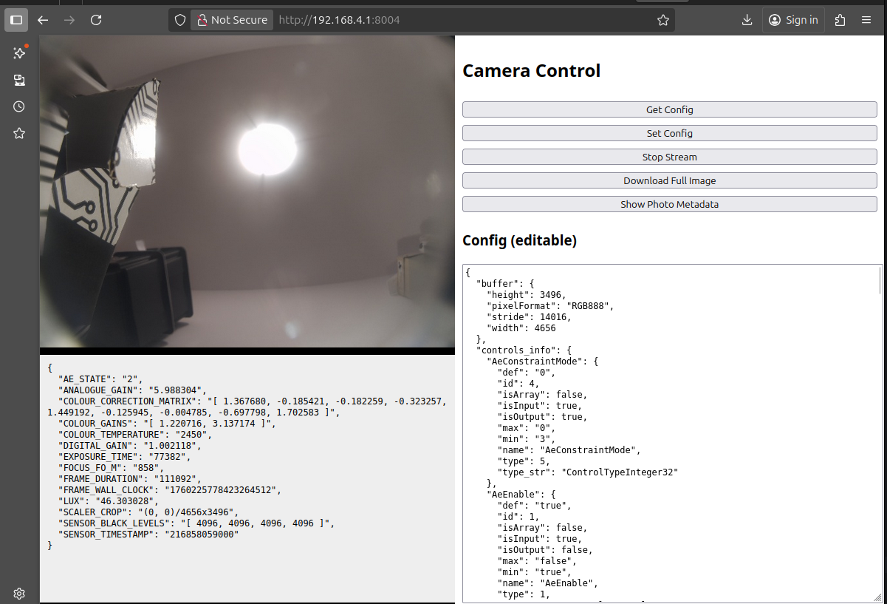

# Mandeye Controller Libcamera driver

This project provides a web-based interface for controlling and monitoring a camera using libcamera. The interface allows you to view the camera stream, download full-resolution images, view and edit camera configuration, and inspect photo metadata in real time.

## Features

- **Live Camera Stream:**
  - The main page displays a live stream from the camera.
- **Photo Metadata:**
  - Photo metadata (from `/photoMeta`) is automatically displayed and updated below the camera image.
  - You can also manually refresh the metadata using the "Show Photo Metadata" button.
- **Download Full Image:**
  - Download the latest full-resolution image via the "Download Full Image" button (calls `/photoFull`).
- **Camera Configuration:**
  - View and edit camera configuration in JSON format.
  - Use the "Get Config" and "Set Config" buttons to retrieve and update configuration via `/getConfig` and `/setConfig` endpoints.
- **Stream Control:**
  - Start and stop the live stream using the provided buttons.
## Prerequisites
```aiignore
sudo apt install libcamera-dev libpistache-dev libopencv-dev
```

Add device overlay to /boot/firmware/config.txt:
```aiignore
camera_auto_detect=0
dtoverlay=imx519,cam0
```

Next test cameras:
```aiignore
pi@lineassistpro:~ $ rpicam-still --list-cameras
Available cameras
-----------------
0 : imx519 [4656x3496 10-bit RGGB] (/base/axi/pcie@120000/rp1/i2c@88000/imx519@1a)
    Modes: 'SRGGB10_CSI2P' : 1280x720 [80.01 fps - (1048, 1042)/2560x1440 crop]
                             1920x1080 [60.05 fps - (408, 674)/3840x2160 crop]
                             2328x1748 [30.00 fps - (0, 0)/4656x3496 crop]
                             3840x2160 [18.00 fps - (408, 672)/3840x2160 crop]
                             4656x3496 [9.00 fps - (0, 0)/4656x3496 crop]

```
## Build Instructions
```
cd mandeye_controller/extras/libcamera
mkdir build
cd build
cmake ..
make
sudo make install
```

## Start service
```
sudo systemctl enable mandeye_libcamera_cam0.service 
sudo systemctl start mandeye_libcamera_cam0.service 
    
``` 

## Endpoints

- `/photo` - Returns the current camera image (used for live stream). Returns 404 ("No
  photo yet") between a config change and the first frame delivered under the new config,
  so a stale pre-restart frame is never served.
- `/photoFull` - Returns the latest full-resolution image for download. Same 404 rule.
- `/photoMeta` - Returns JSON metadata for the current photo. Same 404 rule.
- `/getConfig` - Returns the current camera configuration as JSON. Includes `width`/`height` (active resolution) and `resolutions` (discrete list of selectable modes: pipeline output sizes plus native sensor modes).
- `/setConfig` - Accepts a JSON payload to update the running camera configuration. Each
  apply is a full replace - controls not present in the body are reset to their defaults,
  they do not linger from a previous apply. Structural keys (`width`, `height`, `rateMs`)
  are the exception: if omitted they are inherited from the last applied config so a
  picamera-only POST cannot silently change the resolution (400 if there is no previous
  config to inherit them from). The response body is the camera's start-up console log for
  that apply (sensor modes, resolution validation, any rejected controls); HTTP 500 if the
  camera failed to start. The web UI shows it under the Apply button.
- `/saveConfig` - Accepts a JSON payload, writes it to the USB config file (`--config` path) and makes it the loaded config. Used by the web UI's "Save to USB" button.
- `/presets` - Returns the built-in profiles for the active sensor as `[{ "name", "config" }, ...]` (empty for a sensor with no entry). The web UI "Preset" row loads one into the form; the operator then Applies or Saves to USB.

## Config file

The service is started with `--config /media/usb/camN_config.json`. If the file is missing,
the service applies the compiled-in `default` preset for the active sensor (see below;
libcamera defaults if the sensor has no preset) and then writes the full effective config
back to that path - every resolved control, minus the read-only `controls_info` /
`resolutions` blocks - so the file is a complete, editable baseline from first boot.
Recognised top-level keys:

- `disabled` (bool) - if true the process sleeps forever and does not open the camera.
- `rateMs` (uint) - minimum ms between delivered frames.
- `width` / `height` (uint) - requested stream resolution; `validate()` snaps it to a
  deliverable size and the chosen size is logged (`Resolution: requested ... -> validated ...`).
  If omitted, the service uses the largest native sensor mode (the camera is opened with the
  `Viewfinder` stream role, which otherwise defaults to a small preview size).
  This alone selects the sensor readout mode - on rpi/pisp there is no separate binning
  control (an explicit `SensorConfiguration` is ignored). On the IMX519, `2328x1748` is the
  2x2-binned full-array readout (~4x the signal, about one stop of SNR, at full FOV) and
  `4656x3496` is the full-resolution readout; the other listed sizes are cropped.
- `picamera` (object) - one entry per libcamera control. Scalars are plain numbers / bools.
  Array / rectangle controls take a JSON array: `"ColourGains": [r, b]`,
  `"FrameDurationLimits": [minUs, maxUs]` (microseconds), `"ScalerCrop": [x, y, w, h]`. Keys starting with
  `_` and `null` values are ignored. `NoiseReductionMode` defaults to `1` (Fast) when the
  file does not set it.

## Built-in presets

Ready-made profiles are compiled into the binary (`embedded_configs.h`,
`kPresetsByCamera` keyed by sensor type) and served from `/presets`. In the web UI, the
**Preset** row (shown only when the active sensor has entries) loads one into the form;
review the fields, then **Apply** or **Save to USB**.

### IMX519 (rolling shutter, 16 MP, autofocus)

- `default` - neutral reset: full auto exposure / gain / AWB, full FOV, `2328x1748`
  (2x2-binned readout), only a `FrameDurationLimits` cap so AE can't smear a moving frame.
- `lowlight` - low light, **moving camera**. `2328x1748` binned readout; exposure stays on AE but
  is capped by `FrameDurationLimits [16667, 33333]` (a bright scene still drops the shutter,
  a dark scene pins at ~1/30 s so blur stays bounded); analogue gain is **pinned at the
  sensor max** (`AnalogueGainMode 1` / `AnalogueGain 16`) and brightness is finished with an
  ISP `Brightness`/`Contrast`/`Saturation` lift. `NoiseReductionMode 1` (Fast) - spatial
  denoise only; `2` (HighQuality) adds a temporal pass that ghosts a moving frame, so it is
  not used here. Lower the second `FrameDurationLimits` value (16667 = 1/60 s, 10000 =
  1/100 s) if blur is still visible; drop `AnalogueGain` toward 12 if noise is worse than
  the darkness.
- `lowlight_fastmotion` - low light, **fast-moving camera**. Same resolution and ISP lift, but
  *everything* is pinned - no AE at all: `ExposureTimeMode 1` / `ExposureTime 8000` and
  `AnalogueGainMode 1` / `AnalogueGain 16`. Exposure is identical frame to frame (good for
  offline coloring) and blur is fixed by the 8 ms shutter. Noisiest; over-exposes if the
  camera moves into bright light.

Why gain is pinned rather than left to AE on the IMX519: on this pipeline the AGC parks
analogue gain at ~8 and does **not** raise it when the shutter is capped and the scene is
dark - so relying on `AeExposureMode Short` alone just yields a darker frame. The IMX519
low-light presets therefore pin gain and trade colour fidelity / highlight retention for a
legible image everywhere; they are **indoor / low-light only** and will over-expose in
daylight. There is no digital-gain headroom left once analogue gain is maxed, so if a scene
is still too dark the only remaining levers are a longer exposure (more blur) or more light.

### IMX296 (global shutter, 1.6 MP, colour or mono, fixed/manual lens)

One `1456x1088` sensor mode, 60 fps ceiling (16.6 ms mode floor), no autofocus. Unlike the
IMX519 the AGC **does** raise analogue gain when the frame duration is capped, so the
low-light presets leave gain on AE. Analogue gain tops out at ~15.7x on this pipeline (the
sensor advertises far more, but the rest is delivered as digital gain); an ISP
`Brightness`/`Contrast` lift covers what analogue can't.

- `default` - full auto, `FrameDurationLimits [16667, 33333]` (30-60 fps, shutter <= 1/30 s).
- `lowlight` - **moving camera**. Frame pinned at `[16667, 16667]` (1/60 s) so the global
  shutter can't smear; gain stays on AE; mild ISP lift. Goes noisy below ~20 lux - relax
  the frame cap toward `[16667, 33333]` if you need the light more than the sharpness.
- `lowlight_fastmotion` - **fast motion**. Fully pinned: `ExposureTime 8000` (8 ms) +
  `AnalogueGain 16` (the analogue ceiling, so no forced digital gain). Constant exposure
  frame to frame; noisiest, and dark below ~20 lux - raise `Brightness` or `ExposureTime`.

`NoiseReductionMode 1` (Fast, spatial only) on every preset - `2` (HighQuality) adds a
temporal pass that ghosts a moving frame.

After **Save to USB**, `sudo systemctl restart mandeye_libcamera_cam0` to load it (the
service reads the USB config only at start-up). Each `/setConfig` is otherwise a full
replace - controls absent from the body are reset, not carried over from a previous apply.

## Resolution & FOV

The IMX519 sensor modes have different analog crops (`rpicam-still --list-cameras`):
`2328x1748` and `4656x3496` read the full array `(0,0)/4656x3496` (full field of view,
2x2 bin for the smaller); `1920x1080`, `3840x2160`, `1280x720` are cropped
(narrower FOV, non-zero crop origin). `SCALER_CROP` in `/photoMeta` reports the active
crop in sensor-array pixels. **If it is not `(0,0)/<full array>`, the effective focal
length and principal point differ from a full-array calibration** - any offline
LiDAR<->camera intrinsics must be re-derived per resolution, or pin the resolution to a
full-FOV mode.

## Usage

1. Build and run the server (see your main project documentation for details).
2. Open the web interface in your browser (typically served on port 8004).
3. Use the controls on the right to interact with the camera:
    - View the live stream and metadata.
    - Download the full image.
    - View and edit configuration.
    - Start/stop the stream as needed.
   

## File Overview

- `index.html.h` - Contains the embedded HTML, CSS, and JavaScript for the web UI.
- `LibCameraWrapper.cpp/.h` - Camera control logic (not detailed here).
- `main.cpp` - Main server logic (not detailed here).
- `CMakeLists.txt` - Build configuration.

## Notes

- The web UI is responsive and should work in modern browsers.
- The metadata and image are always in sync, as metadata is fetched with each image update.
- For development, you may need to adjust API endpoint URLs or ports as appropriate.

---


